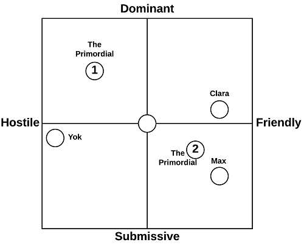
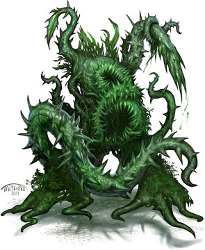
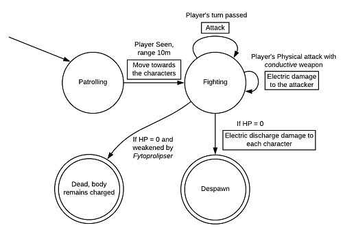
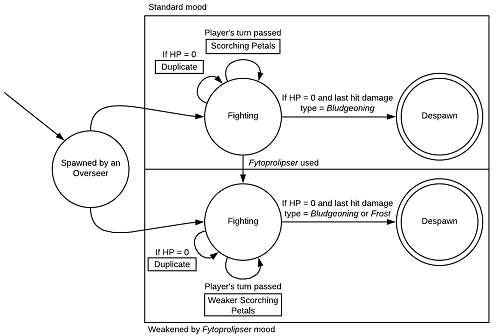

	# Rigmarole DevTeam

# *Space Beyond Space - A Doctor Who Story*

#Level: _Disclosure_

# Level Design Document

**About this document**

| Property      | Description                              |
| ------------- | ---------------------------------------- |
| Purpose       | Unique final document including all main project resources and files. |
| Creation date | 24/12/2017                               |
| Current owner | Giorgio Liggio                           |
| Last edited   | 28/01/2018                               |

**Rigmarole Team**

| Name            | ID number | Email                                 |
| --------------- | :-------: | ------------------------------------- |
| Giorgio Liggio  |  905471   | giorgiomaria.liggio@studenti.unimi.it |
| Alessio Quercia |  918925   | alessio.quercia@studenti.unimi.it     |
| Andrea Salamone |  909907   | andrea.salamone1@studenti.unimi.it    |

This document (including any attachments) may contain confidential, proprietary, privileged and/or private information. The information is intended to be  
for the use of the individuals or entity designated above. Any disclosure, reproduction, distribution or other use of this document or any attachment by an  
individual or entity other than the intended recipients is prohibited.

# History

| Who             |    When    | What                                     | Version |
| --------------- | :--------: | ---------------------------------------- | :-----: |
| Giorgio Liggio  | 24/12/2017 | Created this document.                   |   0.1   |
| Giorgio Liggio  | 29/12/2017 | Added: Overview, Game Information (chapter 1), High Concept, Setting, Background, Themes, World Diagram (chapter 2). Quoted content must undergo review. |   0.2   |
| Giorgio Liggio  | 30/12/2017 | Temporary game title added, chapter 2 filled with current documentation available yet still pending review. |   0.3   |
| Giorgio Liggio  | 02/01/2018 | Fixed "High concept", "Setting"; added early level goal outlines. |   0.4   |
| Giorgio Liggio  | 03/01/2018 | Added level names, expanded level goals, minor fixes. |  0.4.5  |
| Giorgio Liggio  | 04/01/2018 | Improved level names, added more level goals. |   0.5   |
| Alessio Quercia | 04/01/2018 | Added character layouts. Added Clara Oswald and Me. |   0.5   |
| Giorgio Liggio  | 05/01/2018 | Polished level names, added final level goals (except level 6). |  0.5.1  |
| Giorgio Liggio  | 06/01/2018 | Updated level goals.                     |  0.5.2  |
| Alessio Quercia | 07/01/2018 | Added characters: Max, Yok and The Primordial. |   0.6   |
| Andrea Salamone | 08/01/2018 | Completed the enemies section.           |   0.7   |
| Giorgio Liggio  | 09/01/2018 | Branch merging #1.                       |   0.8   |
| Alessio Quercia | 09/01/2018 | Added level puzzles.                     |  0.8.1  |
| Andrea Salamone | 13/01/2018 | Added Characters' stats and Weapons.     |  0.8.2  |
| Giorgio Liggio  | 14/01/2018 | Branch merging #2.                       |  0.8.5  |
| Andrea Salamone | 14/01/2018 | Enemies got more detailed.               |  0.8.6  |
| Alessio Quercia | 16/01/2018 | Added rewards, checkpoints, victory/defeat conditions, game camera description, game mechanics and characters' audio references. Remade fight outcomes, skills and enemies charts. |  0.8.7  |
| Andrea Salamone | 17/01/2018 | Added Interpersonal Circumplexes, rewrote the level story and fixed the FSAs. |  0.8.8  |
| Andrea Salamone | 20/01/2018 | Added fight outcomes.                    |  0.8.9  |
| Alessio Quercia | 22/01/2018 | Added characters' in-game sizes. |  0.8.10  |
| Andrea Salamone | 22/01/2018 | Added level progression, flowcharts and event diagrams. |  0.8.11  |
| Giorgio Liggio  | 28/01/2018 | Branch merging #3.                       |  0.9.5  |

# Index

[TOC]

# 1. Introduction

*Space Beyond Space - A Doctor Who Story* is a video game proposal, non-canon adventure taking place in the *Doctor Who* science fiction series universe. It focuses on the early adventures of Clara Oswald right after the ninth season finale of the BBC television series of the same name.

This project is developed as a stand-alone video game, whereas it has the potential to become the first installment of a video game series, depending on critics reception and the Publisher's Marketing Division future decisions.

## 1.1. Overview

*Space Beyond Space* is a single player, third person role-playing action video game featuring a linear storyline and a slow-paced gameplay. There are fights against enemies, puzzle to be solved, and side quests which are non-essential to completing the game but contribute to the setting and story plot. The game core mechanics are an adaptation of *Dungeons & Dragons 3.5* edition rules.

## 1.2. Game information

**Game title:** *Space Beyond Space - A Doctor Who Story*

**Game genre:** Role-playing game

**Game mode:** single player

**Total levels:** 8

**Developed levels:** 1

**Developed level sub-sections:** 4

**Level name:** *Disclosure*

# 2. Game story

The game story takes place right after the events occurring in the *Doctor Who* ninth season finale; it develops as a spin-off featuring Clara and Me as the main characters.

## 2.1. High concept

The main idea behind the game is as follows:

> Clara and Me's journey leads them to a human settlement on an ancient planet-shaped sentient plant, whom an evil scientist tries to exploit in order to get superhuman augmentations.

It results in an extended, more appealing high concept for the game:

> Landed on a small, green planet, Clara and me discover a human scientific settlement studying the local vegetation. An ancient mystery lies beneath the ground. Adventure yourself in the depths of the research facilities to unveil what threatens people inside. With Clara's brilliance and Me's experience the path seems simple, but people aren’t the only ones to be rescued.

## 2.2. Setting

The game takes place in the 24th century C.E. on a planet whose core is a sentient plant life form. The planet surface mostly consists of vegetation and the atmosphere is likely to Earth’s.

Scientists live in a small colony made up of a spaceport, the main settlement area, and two facilities; such buildings are separate from each other and house research laboratories on multiple underground floors.

Subterranean quarries and caves can be found in the planet strata. One is linked to the plant core and reachable via the second laboratory when playing.

## 2.3. Characters

### 2.3.1. Main characters

The following are the main relevant characters the player interact with throughout the whole game, including both goodies and baddies.

#### 2.3.1.1. Clara Oswald (The Impossible Girl)

**Age**: 27.

**Gender**: Female.

**Values/Virtues**: Brave, Loyal, Clever.

**Personality**: Kind, Feisty, Bossy, Stubborn, Altruist.

**Archetype**: Science Hero, Rebellious Spirit.

**Role**: Protagonist.

**Short Biography**: Clara has been a nanny and a school teacher, even though during her time she has been traveling in time and space as companion of the Eleventh Doctor, and then of the Twelfth one. She is called "The Impossible Girl" by the Doctor, because he met her and saw her dying in different timelines. Sadly for the Doctor, Clara's death became a fixed point in time, when she died trying to save her friend Rigsy, taking the Quantum Shade Me had pointed on him. The Doctor succeeded in extracting her before her death, but she entered a stasis state, becoming functionally immortal. After the Doctor unsuccessfully tried to save her from her death, wiping his memory of her, she decided to face her death, travelling "the long way round" back to Gallifrey using her stolen TARDIS, with Me for company.

**Interpersonal Circumplex: **

#### 2.3.1.2. Me (Ashildr)

**Age**: Universe age.

**Gender**: Female.

**Values/Virtues**: Brave, Agile, Avenger.

**Personality**: Cold, Detached, Vengeful, Bored.

**Archetype**: Action Hero, Rebellious Spirit, Lovable Rogue.

**Role**: Protagonist, Badass.

**Short Biography**: Me is a Viking girl encountered by the Twelfth Doctor and Clara Oswald. After a battle against the Mire, she died, but the Doctor resurrected her using a Mire repair kit, transforming her into an immortal being. During her time, she asked several times to the Doctor to bring her with him as a companion during his travels in time and space, but the Doctor refused each time. For this reason, she became bitter to the Doctor and was convinced from the Time Lords to trick the Doctor into being transported inside his confession dial. Things went differently from what she has planned and Clara died. She didn't mean to kill Clara and apologized to the Doctor, who warned her it would be a good idea for her to stay out of his way. Me survived until the end of the Universe, assisting to its death into a bubble of reality from Gallifrey, becoming the last living being on the Universe and waiting for the Doctor and Clara. When they arrived on Gallifrey, she saw them talking for their last time, when the Doctor wiped his memory of her. Then she decided to travel alongside Clara with her stolen Tardis.

**Interpersonal Circumplex:**

#### 2.3.1.3. Max

**Age**: 34.

**Gender**: Male.

**Values/Virtues**: Benevolent, Smart, Determined.

**Personality**: Polite, Absent-Minded.

**Archetype**: Science Hero, Eccentric Mentor.

**Role**: Supporting Protagonist, Cloud Cuckoolander.

**Short Biography**:  Max is a member of the research team sent on the planet to determine wheater or not the planet could be a possible human colony. His studies are mainly focused on the planet vegetation, indeed he is a plant expert. When the earthquake happened, Max was caught by surprise by some plants and got trapped by some roots growing from the floor. Once saved by Clara and Me, Max initially decided to escape, but then was convinced by Me to fight alongside them to understand why the plants began attacking the humans and to save the human beings on the planet from an imminent catastrophe.

**Interpersonal Circumplex:**

#### 2.3.1.4. Dr. Yok

**Age**: 61.

**Gender**: Male.

**Values/Virtues**: Genius, Altruist.

**Personality**: Irritable, Ambitious, Persuasive.

**Archetype**: Science Villain, Mad Scientist, Person of Mass Destruction.

**Role**: Antagonist, Face Heel Turn.

**Short Biography**: Yok is the leader of the research team sent on the planet to study its structure and liveability. After some studies, he found a way to mix up traits from plants and humans, he made several experiments on the humans in order to create a new form of being, an improvement of the human race, combining together the best traits from both the plants and the humans. The mutants created by Yok are not perfect, they presents several flaws, but his last untested composite is much more powerful than the precedent ones allowing him to reach the *Perfect form*. He kept his plan and experiments secret to most of the scientists on the planet, but in the end Clara, Me and Max find it out and try to stop him. Having no choices, Yok transform himself into a mutant using his last untested composite, reaching the *Perfect form*.

**Interpersonal Circumplex:**

#### 2.3.1.5. The Primordial

**Age**: Centuries.

**Gender**: Not defined.

**Values/Virtues**: Just, Peace Seeker.

**Personality**: Peaceful, Defensive, Protective.

**Archetype**: Villain (then Hero), Turncoat, Eldritch Abomination.

**Role**: Heel Face Turn.

**Short Biography**: A long time ago a sentient plant seed started to attract solid matter to itself. The seed grew up, attracting more and more solid matter and transforming itself into a planetoid. After some time, the seed reached a form which allowed it to live as the planetoid core, letting itself grow as plants all over the surface. Once the humans landed on him, he decided to live in peace with them, because they also seemed to be peaceful and respectful towards him. When the humans started mistreating him he began to react passively and when Yok penetrated his core, The Primordial started to attack humans actively, manipulating the vegetation and creating plant creatures.

**Interpersonal Circumplex:**

## 2.4. Background

Once she was certain the Twelfth Doctor couldn't remember her, Clara got into the TARDIS and joined Me, then the TARDIS dematerialised leaving behind the Doctor and his own TARDIS.

Clara knows she must return to Gallifrey since her death was a fixed point in time, but she decides to take "the long way 'round" so that the two girls could "stop off along the way" and spend time adventuring together.

### 2.4.1. Human settlement backstory

A group of scientists found a planet with an Earth-like atmosphere and decided to settle a camp on it. They also built two laboratories, not too far from the camp, to conduct their studies on the plants. The scientists were studying the planet to understand if it could be a possible human colony. After conducting some research on the planet, the scientists discovered something interesting within the plants: they seemed to have the same DNA.

### 2.4.2. Exoplanet backstory

A long time ago a sentient plant seed started to attract solid matter to itself. The seed grew up, attracting more and more solid matter and transforming itself into a planetoid. After some time, the seed reached a form which allowed it to live as the planetoid core, letting itself grow as plants all over the surface.

## 2.5. Synopsis 

### 2.5.1. First act

**Level 1**
While traveling in spacetime and talking in broad terms about their latest adventure, Clara and Ashildr activate the TARDIS control panel and move towards their next destination.

As soon as they get ready and get out the TARDIS, the two girls realize they were in a human colony on an undefined planet. The diner-shaped TARDIS was ***out of style in spite of the surroundings*** (suggestion: *anachronistic*), though being hidden from the main ways nobody would ever notice it.

**Level 2**
The two girls take a look around, and explore the surroundings. From the looks of the sight and sounds, they were in a sort of landing area for small spaceships. The dead end on their way forces the duo to get inside a building, and as soon as they get outside from the other side they must stop at a guard post for identification. Clara and Ashildr show their psychic badges making up an excuse on the fly and telling them they are fresh crew, and are told that was not the area they were supposed to be since all scientific and technic personnel must stay in the campsite when not working.

Clara and Ashildr wonder what was the reason behind human presence on the planet; after brief investigation, and talking to some NPCs around, they discover the small colony was intended for scientific purposes and eventually colonization, and manage to make up a better cover from that moment on. Next, they needed to find a way to reach the main campsite, discovering there was an automatic railway at the other end of the spaceport. There were displays showing concepts of what seemed a rich and peaceful human city, a form of motivational advertising. Clara and Ashildr get to the railway, and leave for the campsite. **[plot point #1/threshold]**

**Level 3**
The campsite is made up of small modular buildings in which the lives of colonies goes on. By talking to people around (?), Clara and Ashildr learn colonists are mostly scientists and technicians, the rest is maintenance personnel in charge of keeping the colony up and running. They also get to learn there is a main scientific research project which focuses on studying local plants, the only form of life discovered on the planet. Since the girls' cover is being new personnel, they are redirected to the training facility in which they will be instructed about their tasks in the research labs.
 When they get there, the two of them learn about the main discovery of the scientific project: all plant life, despite being varying and different, has always something in common with the rest; it is to believe there is a common root to all plants on the planet, and they are close to a breakthrough.

### 2.5.2. Second act (1/2)

When asking for more info, Clara notices there's something worrying in the answer she's told from their trainer; the plant system has developed like a huge network, like a neural system and maybe even a form of intelligence; however there are rumors talking about voices and a danger, though few people really listen to these.

**Level 4**
Clara and Ashildr crave to know more about what starts to seem more like a mistery. They reach for the centralized archive in the research facility, where everything is stored, by finding a way to access such a reserved area. Reading result papers about studies and experiments, they learn about the unified plant network, possibly originated from a single big seed down below the planet surfaces, which possesses unique properties such as symbiotic adaptation with other plants and remarkable ability to adapt to nearly any environment condition.
**[Rising action, 1]** An emergency lockdown of all systems occurs shortly after the earth rumbles and a light tremble shakes the room, like an earthquake. A loud voice coming from the speakers tells the personnel to reach for the closest gathering area, and the two girls join the others outside of the building.

**Level 5**
After the emergency evacuation it was announced an incident in the underground laboratories, Clara and Ashildr volunteer to go with the rescue team claiming they can somehow help to move in the facility.
Clara and Ashildr get to the laboratories, and split from the rescue team in order to increase the chances to find the missing group of people. They face the security systems of the laboratories, and find a way to communicate to the other squad via a terminal. Once they are told the squad position, it's easy to find the way to them. Meanwhile, strange sounds are heard in the background, like something crawling underneath and around the corridors. Clara and Ashildr find the missing group of researchers, and they act nervous looking forward to get out as soon as possible. On the way back, Ashildr notices there has been a while since they heard from the other rescue team, and that was strange. Eventually they will be found dead or unconscious. Talking to some of the survivors, they pushed to get out quickly, allegedly blaming something gone wrong.
**[crisis]** While reaching for the exit, some plant-like minions appear from the ceiling. The group is confused by their presence, until one of them approaches one of the survivors and attacks. Clara and Ashildr must fight back these creatures, while keeping safe the others. Other encounters take place while reaching for the exit. Clara and Ashildr want to know the truth, and ask questions. The scientists expose their theory about the main seed shifting from a dormant state to active, and trying to defend itself from the humans. However the crew is reluctant to answer this kind of questions, except one which tells Clara they better talk somewhere else, far away from other people. Ashildr is not convinced by him/her, but Clara wants to take the shot. Either talking to the scientist or finding another way to gather more intel, Clara and Ashildr learn that more about the project and its real dangers can be found by talking to the project chief in person, who is missing too though in the other research facility. The duo decides to rescue him on their own.

### 2.5.3. Second act (2/2)

**Level 6**
**[rising action, 2/LEVEL START]** Next objective is to sneak in the second research facility and look for the scientist. He has been missing since the emergency, and nobody seems to know where he is. Clara wants to get to him or his work to make everything clear. The two of them are led by another scientist, who claims to be the professor's assistant, and is truly worried about what is going on in the colony. As well as before, Clara and Ashildr must face the base defense systems before getting to the research labs; everything looks more secured than before, and some areas look untidy as well. They are not able to find the professor, but notice a well-secured area beyond which a passage to a sort of cavern is located. They find a way through and notice some papers and documents, but no relevant information is found. Then they walk to the end of the cavern to find themselves in a great subterrain cave, at the center of which a giant bulb lies.
The stunning view of a giant plant seed from which many roots were coming out from, was accompained by the assistant explaining that was the very core of all the vegetation on the planet, and they were studying it due to its unique properties from a scientific point of view. The plant tries to obstacle the trio when they attempt to get closer, but then holds back and let them move to a certain distance from itself.
They establish a communication, the plant is sentient and talks to Clara and Ashildr; both asks why it is attacking the humans, but the answer is enigmatic: humans attacked first. After some talking, the two girls guessed the plant was just defending itself, but more details emerge when the plant tells them about the other scientist who is "creating monsters" and keeps all the proof in its hidden laboratory. **[revelation/LEVEL END]**

### 2.5.4. Third act

**Level 7**
Clara and Ashildr get back and manage to enter the secured laboratory they saw before; when inside, they find several documents on a research aimed to define the plant's rigenerative properties and a possible application for human beings. Further areas store diagrams showing a prototypal auto-rigenerative human arm, some vials with floating substances, and an archive of documents with the results of the research. Clara and Ashildr realize he was trying to make humans heal as fast as the plant by applying mutations to people, and this thought is confermed by what they find in the last rooms: tubes holding strange hybrid creatures, half-human and half-plant.
**[climax]** They find the professor here, who played lost and waiting for rescue; but then he understands pretending is not necessary anymore, and reveals its plan to Clara and Ashildr who were asking many questions. Then he runs away with some documents and vials, locks the door behind himself and frees the monsters inside the tubes.
Clara and Ashildr must fight for their lives. Once every enemy is defeated, they must find a way out of there and chase the professor before he gets away with his illicit experiments on the plant and on other personnel members.

**Level 8**
The two girls manage to get through the traps and obstacles activated by the professor fleeing. They find him and face him in a lasting fight; he uses its vials to summon his creatures, and ***finally augments himself*** in a desperate attempt to defeat Clara and Ashildr.
The two girls win the fight, and take the professor with them out of the facility, telling the others what really happened and his real intentions. He's brought away from the planet and ***everything is fixed*** to continue the life in the colony in peace once again.

## 2.6. Themes 

The main themes of the story are:

- Man vs. nature;
- Cruelty and beauty in the world;
- The corrupting nature of having great powers;
- Transhumanism.

## 2.7. Periodic Table of Storytelling References

The references for the main characters are listed below:

- Clara: _Action Girl_, _Badass Bookworm_.
- Ashildr: _The Ace_.
- The Seed: _Eldritch Abomination_, _Heel Face Turn_, _MacGuffin_.
- The mad scientist: _Mad Scientist_, _Manipulative Bastard_.
- The helping scientist: _Cloudcuckoolander_, _The Determinator_.

The story is based on _Three Act Structure_: Clara and Ashildr receive and accept a _Call To Adventure_, they apparently have to face the confrontation with an evil _Eldritch Abomination_ which then is discovered to be a _Heel Face Turn_ and a _MacGuffin_, being the centre of the _Mad Scientist_’s research. The _Resolution_ of the story consists in having the goods defeating that _Manipulative Bastard_ of a scientist with a final _Reveal_ of his _Evil Plan_.

## 2.8. World diagram

## 2.9. Goal outlines

Clara and Me's primary goal through the game is to save The Primordial, an ancient form of life threatened by Dr. Yok's secret experiments in a human settlement located on a planet far away.

### 2.9.1. Level 1 - *Advent*

**Level type:** tutorial

**Main goal:** Get out of the hangar

- Go to Me's room (movement tutorial)
- Train with Me (basic attack/defense tutorial)
- Get out of the TARDIS (interaction tutorial)
- Find the switch to open the hangar doors

**Reward:** Learning the basic skills.

### 2.9.2. Level 2 - *Daybreak*

**Level type:** normal

**Main goal:** Reach the settlement

- Attend the welcome commitee speech
- Talk to the disapponted technician
- Get your equipment
- Reach the railway

**Reward:** Obtaining the scientific equipment.

### 2.9.3. Level 3 - *Portent*

**Level type:** HUB

**Main goal:** Investigate the colony

- Check in at the lodgings
- Visit the main facilities
- Follow the rescue team
- Talk to the medic

**Reward:** Discovering information about the colony.

### 2.9.4. Level 4 - *Contingency*

**Level type:** normal

**Main goal:** Retrieve the secret research documents

- Figure out a way in the central archive
- Sneak into the archive
- Get a security clearance
- Access the terminal
- Get out for evacuation

**Reward:** Discovering information about the plants.

### 2.9.5. Level 5 - *Backlash*

**Level type:** normal

**Main goal:** Save the trapped scientists

- Bypass the damaged security system
- Save the personnel in the underground room
- Contain the anomaly
- Fight the plant minions
- Escape the facility

**Rewards:** 
- Obtaining the *Dual element gun*.
- Obtaining the *Strong branch*.

### 2.9.6. Level 6 - *Disclosure*

**Level type:** normal

**Main goal:** Find Dr. Yok

- Save Max from the plant creature
- Help Max preparing the useful serum
- Reach the underground levels
- Reactivate the main generator
- Get the codes for the cave entry's door
- Reach the end of the cave

**Rewards:** 
- Discovering some information about Yok and his plan.
- Discovering information about the planet's core and the plants.
- Obtaining the *Daggers*.
- Obtaining a new party member, Max.
- Obtaining the *Fytoprolipser*.

### 2.9.7. Level 7 - *Deception*

**Level type:** normal

**Main goal:** Unveil Dr. Yok's plans

- Access the restricted area
- Inspect the documents
- Interrogate Dr. Yok
- Survive the mutants
- Escape the area

**Rewards:** 
- Discovering Yok's plan.
- Obtaining The Primordial's help.

### 2.9.8. Level 8 - *Uplift*

**Level type:** normal

**Main goal:** Chase and defeat Dr. Yok

- Avoid the security traps
- Fight back against the monsters
- Defeat Yok
- Leave the laboratories

**Reward:** Saving the colony from Yok's evil plan.

# 3. Level description: *Disclosure*

## 3.1. Level information

Once outside the first laboratory, Clara and Ashildr meet some of the scientists they saved in the underground facilities. They are told something happened in the underground facilities of the second laboratory, where the professor Yok was used to work, and they decide to go looking for some intel about what happened. Three scientists offer to accompany the girls inside the second laboratory, but suddenly the door opened and a couple of scientists run out of the lab screaming with fear, making them change their minds. The scientists refused to go inside the laboratory complex, they wouldn't risk their lives once again. Clara and Ashildr adventure out by themselves inside the lab, which apparently seems desolate, to look for some info and for Yok. First rooms are empty, but, after hearing calls for help, they find a scientist hiding inside a room's cabinet, blocked by a plant creature. Ashildr succesfully defeat the plant, letting the scientist out from the cabinet. He presents himself as Max and explains them the plants had come to life and were rebelling against humans, just like the two girls knew. Ashildr asked the scientist to go away from the lab, he would have impaired them. Max refuses to go away, he was determined to find professor Yok, he tells the girls that he was near to the final distillation of a new type of substance that could have altered some properties of the plants, so the creatures too. After some argument, Clara decides that they had to help Max, if his serum had the effects he assured, they could have gone deeper into the laboratory complex. The scientist ask the girls to bring something he could not have taken alone: the almost ready serum in his locked cabinet, because he lost his key when trying to escape; a molecular extractor from a lab closed by an emergency lock. With everything ready, Max can finish his serum in the Hydroponic Lab, proudly calling it "Fytoprolipser". After arming its chemical dart gun, Max is ready to proceed further, joining the two girls. The way for the underground floor was blocked by a great wooden wall with something similar to a dormant face, Max starts with a catchphrase, knowing it was a plant creature, and shoots a dart filled with his Fytoprolipser to the wall. After a brief tremble, the wooden obstacle starts to change form, with its face waking up and becoming a bulky plant creature, the Treant. With some efforts and thanks also to the newfound member, the group manages to defeat the creature and continues it's search for Yok, finding some intels about a so-called Room X on the underground floor.

The underground floor, is a dark area, without any sign of electricity. Many automatic doors are locked, Clara states that they have to reach the main generator, asking Max to guide them. Ashildr gets impressed by some creatures she never saw before: the Elevines, plant creatures with electricity flowing in their bodies. Max says to the others that he did experiments with plants that stored electricity in some bulbs, the Elevines had to be very similar to those plants, so he assumed they could use them as "batteries" to overcharge some doors and freeing the way. Unexpectedly, when defeated, these creatures discharges their bodies, damaging the surroundings. After walking, another group of Elevines is found, this time Max used the Fytoprolipser, disabling the creatures' ability to discharge. Thanks to some bulbs taken from the electric plant creatures, the group reaches the generator, discovering that all the energy is being redirected to the blossom of a greater plant creature, a Thunder Blossom. The only way that could wipe out the creature is by overcharging the main generator by activating every secondary one. After doing this, the plant creature's blossom finally explodes and the light can come back to the floor by reactivating the generator. With the electricity now turned on and the automatic doors finally unlocked, the group can reach the Room X. What is found in there is not clear to Max, neither to Clara or Ashildr, there are papers and mails that suggest something not in line with the complex main research goal and many details lead to the cave further beneath the ground where the Seed, the source of every plant in the planet, could have been found. The door leading to the cave is obstructed by some sturdy vines, by activating the hydraulic, manual system the group proceeds.

The underground cave is strangely full of vegetation with the upper side covered by some shiny resin crystals. Bright lines on the ground mark the pathway used by magnetic carts for material transportation. The group is suddenly surrounded by a lot of plant enemies growing from some strange roots on the ground. After defeating the first creatures, the hoped way for the Seed is reached after avoiding those dangerous roots. Finally, the attention of the group was drawn by a bright light reflecting out from a hole in the ground, with a drill next to it. Clara stated that the earthquake was surely caused by the unauthorized excavations in this place. Entered the hole, the group walked until the end of the excavated tunnel, following the light. They find a giant, bright thing similar to a Seed, a loud noise of roots moving is heard and a shape resembling some kind of face forms from a nearby stone. The face stated that they were not the usual scientists that visit his core. Max, Clara and Ashildr, astonished, talked to the face, introducing itself as The Primordial, uncovering the final truth. The real enemy is that professor Yok, the seed was the main test subject!

**Enemies Chart**
The following table shows which enemies the player will encounter in the different game's levels.

| Enemy / Level   | Advent | Daybreak | Portent | Contingency | Backlash | Disclosure | Deception | Uplift |
| --------------- | -------| -------- | ------- | :---------: | :------: | :--------: | :-------: | :----: |
| Liannoyers      |        |          |         |      X      |    X     |      X     |           |        |
| Needlers        |        |          |         |      X      |    X     |      X     |           |        |
| Treant          |        |          |         |             |          |      X     |           |        |
| Fire Flower     |        |          |         |             |    X     |      X     |           |        |
| Spore Sprayer   |        |          |         |             |    X     |      X     |           |        |
| Elevines        |        |          |         |             |          |      X     |           |        |
| Thunder Blossom |        |          |         |             |          |      X     |           |        |
| Overseer        |        |          |         |             |          |      X     |           |        |
| Mutants         |        |          |         |             |          |            |     X     |     X  |

**Skills Chart**
The following table shows which skills the player will have to use in the different game's levels.

| Skill / Level              | Advent | Daybreak | Portent | Contingency | Backlash | Disclosure | Deception | Uplift |
| -------------------------- | ------ | -------- | ------- | :---------: | :------: | :--------: | :-------: | :----: |
| Moving                     |    X   |     X    |   X     |     X       |     X    |      X     |     X     |     X  |
| Attacking                  |    X   |          |         |     X       |     X    |      X     |     X     |     X  |
| Interacting                |    X   |     X    |   X     |     X       |     X    |      X     |     X     |     X  |
| Open doors                 |    X   |     X    |   X     |     X       |     X    |      X     |     X     |     X  |
| Pick up items              |    X   |     X    |   X     |     X       |     X    |      X     |     X     |     X  |
| Use weapons                |        |          |         |     X       |     X    |      X     |     X     |     X  |
| Picklocking                |        |          |         |     X       |     X    |            |           |        |
| Hacking                    |        |          |         |     X       |     X    |      X     |     X     |        |
| Highlight useful items     |    X   |     X    |   X     |     X       |     X    |      X     |     X     |     X  |
| Highlight scientific items |        |          |         |             |          |      X     |     X     |     X  |
| Use Fytoprolipser          |        |          |         |             |          |      X     |     X     |     X  |

## 3.2. Level diagram

[ Global level diagram goes here ]

## 3.5. Section description: *Laboratories, Ground floor* 

### 3.5.1. Overview 

This is the ground floor of the second laboratory complex, everything has strict geometric shapes, metal is the main material and some information screens can be observed, the zones look abandoned, each person flew away when the earthquake occurred, in spite of that, the complex feels welcoming. The structure has not been damaged and some props can be found fallen to the ground and/or damaged.

The section can be freely explored by the player controlling Clara and Me, their main objective is to find clues about the earthquake and search for Professor Yok, they needs to advance further in the second laboratory complex, no enemies are involved and a side quest, involving two NPCs, can be completed.

**Section's color palette:**

### 3.5.2. Section diagram

### 3.5.3. Section progression description 

**Main quest:** Find Professor Yok and clues about the earthquake.

After the cutscene, the two girls look at the main hall of the section and a **dialogue** starts:
1. **Clara to Me:** "I wonder what we will find in there."
2. **Me to Clara:** "Whatever we will find here, use your sword-thing as before, I think we won't meet beautiful flowers!"

The player can explore the areas: videos can be watched in the auditorium, explaining some of the settlement's main goals; security cam records can be observed in the security room by interacting with the console, no clues of Yok fleeing away can be found.

**Side-quest:** *The beloved in the garden*
The side quest can proceed in two ways:

- If the player reaches the garden, they will hear a voice from behind a mass of vines blocking all the entrances:
  - A woman inside the garden tells the girls that she is trapped there and her beloved colleague was looking for something useful to wipe out the constantly growing vines.
  - The player can attack or use skills on the vines but the only effective skill is Clara's <u>Frost Stream</u> followed by a basic attack.
  - If the player manages to wipe out the vines after using the proper skill, the woman will thank the girls and go to the section's entrance asking them to look for her colleague.
- If the player reaches the engines section without wiping the vines blocking the entrance, he will find a scientist desperately searching something and a **scripted sequence** starts:
  - The scientist tells the girls that his beloved colleague is trapped inside the garden and he is searching for something that could have frozen the constantly growing vines surrounding it letting him destroy them. Clara has a solution, she can freeze the vines with the <u>Dual Element Gun</u>.
  - After reaching the garden, the player can target the vines blocking the entrance of the garden, letting Clara freeze them and then Me attacking with her <u>Strong Branch</u>.
  - The freed woman thanks the girls and tells them to notice her colleague that she will wait him at the entrance.
- Upon finding the woman's colleague, the girls will tell him that they saved his woman. The man will thank the girls and give them the <u>Daggers</u> as a reward.

Walking towards the stairs, the player will reach the basement section.

### 3.5.4. Section Flowchart

### 3.5.5. Section Event Diagram

## 3.6. Section description: *Laboratories, basement*

### 3.6.1. Overview

The basement section of the second laboratory complex is a cold area, where rooms are filled with holographic consoles, scientific devices, plants as test subjects inside incubators and everything any scientist needs for his studies. An hydroponic lab is also present and, in front of the entrance stairs, part of the wall is broken, with dirt and roots pouring to the ground. Some walls are also damaged and pierced by giant roots.

The player controls Clara and Me and has to find informations about the earthquake and Professor Yok. The scientist Max is met in the section, after freeing him and completing his sub-quest, he will join the group.

A new enemy is found, other than *Liannoyers* and *Needlers* seen in the previous levels, a *Treant* is blocking the way leading to the lifts for the next section and a *Spore Sprayer* contaminates the laboratories zone.

**Section's color palette:**

### 3.6.2. Section diagram

### 3.6.3. Section description

Upon entering the section the player can explore the section with some limitations: the corridor leading to the lift is blocked by a strange wall made of wood and leafs and neither Clara nor Me has access to the laboratories section.
The only accessible ways are the one leading to the hydroponic lab and a near room. Two *Liannoyers* are found whipping a reinforced glass door with a scientist behind.
The player fights the two enemies, freeing the scientist whose name is Max. He locked himself in that room, hunted by those creatures, dropping out the distillation of a peculiar serum.

A **dialogue** starts:

1. **Max to the Girls:** "I owe you my life! I was finishing the distillation of something that could help all of us, but a strange creature crawled outside the air ducts, starting to spray cat.LB231 spore type, lethal to anyone who breathes them... I had to run away and I got hunted by those monsters, I even lost my cabinet's key!!"
2. **Me to Max:** "You risked your life and you're worrying about your cabinet's key! Funny thing."
3. **Clara to Max:** "Well, don't worry, we need to find Professor Yok, feel free to get out from this place, but we wouldn't mind for another helping hand."
4. **Max to the Girls:** "For sure I will go with you, I want to show my serum to Professor Yok, he will be astonished! But first I need your help. I must finish the serum, I have something to take from the lab zone but it is contaminated by that <u>Spore Sprayer</u>..."
5. **Clara to Max:** "I am a professional diver, I can hold breath for very long time, I can go get what you need!"
6. **Me, joking:** "Yeah and I am immortal!!"
7. **Max:** "Awesome! Let me open the door for the lab zone!"
8. **Me to Clara:** "Did he really get it?!"

**Sub-Quest:** *A miracle serum*.
The door for the lab zone is opened by Max that then moves to the Hydroponic Lab waiting as a NPC.

The player can command Clara to walk inside the contaminated zone to take the items needed and bring them to Max.

Items needed:
- <u>Almost ready serum</u>: found inside Max's cabinet in the lab zone.
- <u>Key to Max' cabinet</u>: found inside the lab zone.
- <u>Molecular extractor</u>: found inside a locked room in the lab zone, <u>Hacking</u> required to unlock the door.

After giving the items to Max, a **cutscene** starts: the group goes to the Hydroponic lab and Max gets some plant creature parts, uses the molecular extractor and pour the result to the compound that finally becomes the so-called *Fytoprolipser*. Max then says that they have to find a first test subject.
**Sub-quest end.**

When the player reaches the strange wall blocking the way for the elevator, Max says that he needs to try the *Fytoprolipser* on it, after doing so, the wall changes its form becoming a bulky plant creature called *Treant* by Max himself. The fight against this creature begins.

Defeated the *Treant* the player can proceed to the next section.

### 3.6.4. Section Flowchart

###3.6.5. Section Event Diagram

## 3.7. Section description: *Laboratories, underground*

### 3.7.1. Overview

The underground section of the second laboratory complex is a dark area, with no lights, due to the absence of electricity, the structure and contents are similar to the previous floor except for the laboratories location. The section gets more illuminated when the generator is turned on and machines will begin to work again. A door blocked by strong vines is found at the end of the floor's main hallway, the zone after this door is wrecked by vines and roots.

The player controls Clara, Me and Max and has to face new enemies: the *Elevines* and a *Thunder Blossom* that grasps the main generator, causing a black out and avoiding the player to continue his search for Yok. 

**Section's color palette:**

### 3.7.2. Section diagram

### 3.7.3. Section progression description

As the player enters the section, a **cutscene** starts: the area is so dark that the characters can barely see, soon some *Elevines* are seen slithering through a corridor, lighting it up for the time they pass over.

After the cutscenes, a **dialogue** starts:
1. **Max to the girls:** "Did you see those bright creatures?! I think they're generated from a lightning bulb me and my team were studying. I don't really know why, but after seeing them I got that bulb in mind, it had a marvelous trait of containing and conducting electrical current."
2. **Me to Max:** "I know you're in love with plants, but we barely see, we have to check what happened to the generator and some doors are locked too."
3. **Max, ignoring Me:** "I want to check what are the effects of my *Fytoprolipser*, I think it can reduce their conductivity or something like that!"
4. **Clara, keeping Max with feet on the ground:** "Max! Don't think about science for now, please, we need to reach the main generator."
5. **Max to Clara:** "But every problem is fixed by science! We can use those creatures' electric bulb to overcharge electric devices and doors, freeing our path."
6. **Clara to Max:** "Oh... I hope you're right. Do you see that light coming from that room? Let's go check in there first."
7. **Max:** "I hope the *Elevines* are in there!!!"
8. **Me to Clara:** "Watching your back wasn't enough, right? Now I have to look for this weirdo too."
9. **Clara to Me:** "He's more useful than we thought as you saw before. I think we're going to the right direction."

The player can walk towards the illuminated room. This is the main generator room, after entering it, the group is surprised by a big plant creature grasping the generator and a **scripted sequence** starts: Max calls the creature as the *Thunder Blossom* he says that it should be a bigger version of the *Elevine* capable of containing large amounts of electricity. The *Thunder Blossom* starts to discharge lightning bolts to the characters and they are forced to run away from the room. The cause of the black out was discovered.

**Sub-quest:** *Let there be light*

A **dialogue** starts: 
1. **Clara to the others:** "According to the underground floor plan there are five auxiliary generators that are not activated because the main generator results active. I think we could try to activate each one of them, the main generator will surely overcharge and shut down. The plant creature could explode, or, in the worst case, it will detach from the generator..."
2. **Me to Clara:** "And we'll have to wipe it out."
3. **Max to the girls:** "The Electric bulbs that we studied had a limited energy storing capacity, according to its dimensions, I think that the creature's bulb is almost at his maximum capacity. If we give it a lot of energy in one time, I think it'll surely explode."
4. **Clara to the others:** "Let's do this!"

The player has to find the five auxiliary generators in five different rooms, two rooms have their doors closed without energy, *Elevines* can be found in the section and, by defeating them and using the *Fytoprolipser*, <u>Electric Bulbs</u> can be extracted from them. The other three room's doors are opened, two couple of *Elevines* are present in two rooms and the other one is empty.

With an <u>Electric Bulb</u> ready, the player can overcharge a door's control panel and enter the room, activating the secondary generator by interacting with the console related.

After activating each secondary generator, the player can return to the main generator's room to check if the plan worked. Upon entering the room a **scripted sequence** starts, involving the *Thunder Blossom* that, overcharged by too much energy, explodes. Clara thanks Max for the informations given and, after reactivating the generator, the lights turn on with the joy of the group.
**Sub-quest end.**

The area can now be freely explored, the door at the end of the floor's main hallway can now be opened, the player cannot open the door leading to the cave, some access codes are needed.

After entering the Room X, the player can look for evidences about the earthquake or something that could lead to Professor Yok. Upon <u>hacking</u> the main terminal of the room, access codes for the cave's door are found also with some information not in line with the main research plan and a **dialogue** starts:
1. **Max, reading from the monitor:** "Plant DNA hybridation?! This is not what we're working for, at least according to what I know... A lot of information lead to the underground cave where the Seed is."
2. **Clara:** "There are also advices for missing workmen, but the recipient is not the same as this account, they're like... Redirected. "
3. **Me:** "Linking the two things together, we might have someone who's experimenting with plant hybridation."
4. **Max:** "But someone would have noticed the missing people."
5. **Me:** "An earthquake occurred, do you remember? Maybe someone was searching for them, but it doesn't count anymore."

The group now proceeds towards the underground cave.

### 3.7.4. Section Flowchart

### 3.7.5. Section Event Diagram

## 3.8. Section description: *Underground cave*

### 3.8.1. Overview

<!--Detailed level section information paragraph: name, type, setting, goal(s), involved characters, involved enemies, involved skills, preconditions, puzzles.-->

This section of the level takes place in a cave, a totally different ambient from the previous. The cave is astonishing, filled with bright crystals made of plant resin that emit soft orange light, making the ambiance warm. The sides are filled with roots and some green vegetation fills the area. Bright lines can be found on the ground, working as rails for the magnetic carts used for material transportation, these carts are not working and lie idle on the ground.

The player controls Clara, Me and Max and their path to the planet's Seed will be disturbed by the *Overseers* spawning *Fire Flowers* and a *Thunder Blossom* for a side-quest. This is the final section of the level.

**Section's color palette:**

### 3.8.2. Section diagram

### 3.8.3. Section progression description

<!--Step-by-step description of level section, including zoom-ins from the level section diagram, level story quotes and dialogues, the more the better.-->

Upon entering the cave, a **dialogue** starts:
1. **Clara to Max:** "Have you ever been here, Max?"
2. **Max, looking at the top of the cave, like hypnotized:** "No... I always saw this place by pictures of the cave research team, I wasn't part of them... DAMN! I had to apply for the cave team, this place is astonishing!"
3. **Me to Max:** "Man, it's too late to complain. Any idea how to get to the Seed?"
4. **Max to Me:** "How am I supposed to know? I think they was doing some further excavation to reach it, we can try to find an excavation site."

The player has to find the excavation site. Some paths are filled with *Overseers*, if the player walks on them, they will spawn *Fire Flowers*.

<u>Mining Suit</u> and <u>Pulse Hammer</u> can be found in this section.

**Side-quest:** *Another Blossom...*

The player can reach a hidden area of the cave, finding a *Thunder Blossom* that seems to be excavating upwards. A **dialogue** starts:

1. **Max:** "Oh, this isn't good. If this creature keeps damaging the cave's walls they will surely collapse!"
2. **Clara:** "I wonder why it is acting like this..."
3. **Me:** "By the way, I don't want to be buried here, let's quash this thing."

A **fight** against the Thunder Blossom starts.

If the player manages to defeat the enemy, a **scripted sequence** starts, involving Max that creates a new type of <u>Chemical Dart Gun</u>'s ammo type: the <u>Shock Dart</u>. **Side-quest End**.

**[cinematic]**

Upon reaching the caves exit, the trio enters a tunnel leading to a brilliant white light source. They reach the very place where life on the planet had origin: the scientists call it the Nexus. Here lies an enormous plant-like creature, taking up most of the cave's space, grasped to the walls with a lot of branches.

The team walks in slowly, they take a look around before focusing on the giant plant. As they stop after a while, roots from the ground twist around each other, resembling a human-like shape; the face is the last part to be formed, and starts talking after a while with a calm deep voice, slowly but firmly:

**Primordial:** You are stubborn, evil. Dare to come here whenever you want, again...

**Clara:** What? Wh... What are you talking about?

**P:** Mmm... You are not him, are you? No. But your friend, here, he looks like him.

**Max:** I am wh...?

**C (interrupts):** Who? Who is 'him'?

**P:** If you are not him, then, who are you, mortals?

**C:** My name is Clara, and they are Me and Max. They are friends.

**Me:** What... Ehm, _who_ are you, plant?

**P:** I'm a living being, just like you are.

**Me (to herself):** You don't say.

**P (keeping talking):** I grow, I nourish, I live. I am what I am. Though, if it's a name you want, you can call me as he does: Primordial.

**Max (trying to contain excitement):** This is unbelievable...! He talks! He can talk! I've never seen things like this before!

**Me:** How did you get there? Why are you here so deep in the ground? What are you doing on this planet?

**P:** I did not get there, I had always been there. I am not in the ground, the ground is around me. I have no purpose on this planet. I _am_ the planet.

**Max:** Yes, he's right. It's been millennia since he settled here, growing slowly and pushing his roots and branches all around him. In fact, he is the core around whom the planet itself grew from the beginning.

**P:** However, you mortal creatures do not care about other living beings. [reluctantly] Humans... Cutting me and taking samples for the sake of feeling stronger than the others. And he is the meanest, attempting to create life from other life.

**Me:** I guess this thing is talking about...

**C:** ... Dr. Yok, exactly. He must know way more than anybody else, we must...

**Max:** No, it can't be. Yok spent his whole career working for the Project, this all makes no sense! It can't make sense...

**C:** Don't be silly, Max! Think about it, Yok wants to exploit this specimen for unknown reason, and took advantage of the Project to keep his real plans a secret. This means he's running secret experiments on Primordial, and Heaven knows what he means to do!

**Me (slightly sarcastic):** Well, it's not that hard to connect the dots actually, Max.

**C:** We must find him as soon as possible.

**P:** You can find your evil friend in his place. He is always in there, contemplating his children...

**C:** We must find the entrance to Yok's laboratories before it's too late. He can't get away with this!

### 3.8.4. Section Flowchart

###3.8.5. Section Event Diagram

# 4. Level puzzles

In this section are described the puzzles included in the 6th level, *Disclosure*.

## 4.1 Help Max preparing the serum

**Problem**

**Solution**

## 4.2. Overcharge the generators

**Problem**
A giant electric plant is wrapping around the floor main electric generator, absorbing all the energy and letting the floor in the dark. 
The player can approach the plant and fight, but it won't get hurt, and the player eventually gets damaged.

**Solution**
The only way to beat it is overloading the plant by turning on the supplementary independent generators located in the other rooms, so that the plant can't deal with this amount of energy and blowing up. Then, the only thing to do is turning the generator on once again:

1. Find and turn on all smaller generators (*gen*) [yellow arrows].
2. All smaller generators overload the main generator (*GEN*), the plant cannot absorb this amount of energy and blows up 3 seconds after the player gets back to the main generator room [red arrow].
3. A black-out follows, turn on the main generator [blue arrow] and continue the game by opening previous locked electric doors.

## 4.3. Unlock the door

**Problem**
The door leading to the Cave is blocked by some roots, which cannot be destroyed using weapons.

**Solution**
The player has to find a way to unlock the door to reach the Cave:

1. Try to open the door, but it won't open, because it's blocked.
2. Find the hydraulic system.
3. Overcharge the hydraulic system using the valves. The water pressure increases, allowing the door to receive much more energy.
4. Open the door. The water pressure is so high that the door will quickly open, destroying the roots blocking it.

# 5. Gameplay considerations

## 5.1. Rewards

Completing the game quests, the player will be rewarded in different ways (see Goal Outlines section): sometimes the player will receive tangible rewards, such as weapons he might use during the game, sometimes he will be paid back with game story's information. Besides, playing the game the player will learn the characters' skills and will be able to test them over enemies, puzzles and obstacles.
Immersive story and gameplay will implicitly reward the player throughout the game.

## 5.2. Checkpoints

The game will auto-save after completing a quest. Thus, losing during a quest means restarting from the ending of the previous quest.
The player can restart anytime from the last checkpoint or load a previous one.
The player will be also able to save the game anytime he wants, except during a fight.

## 5.3. Victory conditions

If one of the party members controlled by the player dies (reaching 0 HP), the player will lose the game and will have to restart from his last checkpoint.
The player will win the game by completing the main quests in the game levels without losing any party member.

## 5.4. Game camera

The game camera is a free camera, meaning that the player might freely move it in any direction, zoom in and out, and completely rotate it.
The player can also choose to lock the camera on the character he is currently using, meaning that the camera will follow that specific character from above, mantaining the possibility to zoom in and out and to rotate. Locking the camera on a character, the player won't be able to move it in any direction.

## 5.5. Game mechanics

The player will be able to control the main characters in two different modes: *party mode* and *single character mode*. He will be able to switch from a mode to another during the game.
Using the *party mode* (standard mode), the player will control the main characters as a party. Thus they will move together to the player's chosen positions and make the player's chosen actions.
The player will also be able to select a character and to use the *single character mode*, controlling that character individually.

## 5.6. Characters' gameplay informations

This section presents the ability scores of each character in the level, among with their combat stats and skills.

### 5.6.1. Clara

| Ability        | Score | Modifier |
| :------------- | :---- | :------- |
| *Strength*     | 8     | -1       |
| *Dexterity*    | 16    | +2       |
| *Consitution*  | 11    | 0        |
| *Intelligence* | 18    | +3       |
| *Wisdom*       | 12    | 0        |
| *Charisma*     | 14    | +1       |

| **Stat**                       | **Value** |
| :----------------------------- | :-------- |
| *Armor Class (AC)*             | 8         |
| *To Hit Armor Class 0 (THAC0)* | 10        |
| *Health Points (HP)*           | 20        |

**Combat weapon used**: <u>Dual element gun</u>.

**Skills**:

- *Taekwondo*: Clara has been learning the martial art after teaching in the school. She has also helped some of her students in learning it. Her barehanded attacks' damage benefits from *Dexterity* modifier.
- *Fencing*: During her time with the Doctor, Clara learned self-defence skills like fencing. Thanks to Me that repaired the <u>Dual element gun</u>, Clara can use it as a rapier due to its shape and manageability.
- *Highlight useful items*: Clara is smart and curious about the surroundings, she can highlight items around her.
- *Hacking*: Clara had no computer skills at first, she became a computer genius after being uploaded into the Wi-Fi by a Spoonhead, so she can hack certain door's control panels and terminals.
- *Who needs to breathe?!*: After being saved from her death by the Doctor, Clara became functionally immortal. She lost all physical qualities such as breathing, a pulse and even ageing, being stuck "between one heartbeat and the next".

### 5.6.2. Me (Ashildr)

| Ability        | Score | Modifier |
| :------------- | :---- | :------- |
| *Strength*     | 13    | +1       |
| *Dexterity*    | 18    | +3       |
| *Consitution*  | 16    | +2       |
| *Intelligence* | 11    | 0        |
| *Wisdom*       | 12    | 0        |
| *Charisma*     | 16    | +2       |

| **Stat**                       | **Value** |
| :----------------------------- | :-------- |
| *Armor Class (AC)*             | 5         |
| *To Hit Armor Class 0 (THAC0)* | 10        |
| *Health Points (HP)*           | 30        |

**Combat weapons used:** <u>Daggers</u>, <u>Strong Branch</u>, <u>Pulse Hammer</u>.

**Skills**:

- *Combat Expert*: Thousands and thousands of years granted Me a formidable combat expertise. She can fight with any kind of weapon or everything that can be used as a weapon.
  - <u>Provoke</u>: attracts enemies attention making Me their priority target for two turns.
- *Picklocking*: Me has been a thief during a period of her life. She learned how to picklock keyholes.
- *Health regeneration*: Me is a human-Mire hybrid, she was resurrected by the Doctor altering a Mire repair kit to fix human physiology knowing that she would continually be fixed, thus losing the "ability" to die. She has continous health regeneration (1d4 each turn), upon reaching 0 HP, Me will enter an inactivity phase for two turns, where she will regenerate to full health. When out of combat she regenerates 1d4 HP every 1.5 seconds.

### 5.6.3. Max

| Ability        | Score | Modifier |
| -------------- | ----- | -------- |
| *Strength*     | 8     | -1       |
| *Dexterity*    | 14    | +1       |
| *Consitution*  | 13    | +1       |
| *Intelligence* | 18    | +3       |
| *Wisdom*       | 16    | +2       |
| *Charisma*     | 7     | -1       |

| **Stat**                       | **Value** |
| ------------------------------ | --------- |
| *Armor Class (AC)*             | 6         |
| *To Hit Armor Class 0 (THAC0)* | 10        |
| *Health Points (HP)*           | 25        |

**Combat weapons used:** <u>Chemical Dart Gun</u>.

**Skills**:

- *Science is life*: Thanks to his laboratory and scientific knowledge, Max can easily detect scientific items, highlighting them. Besides, he can suggest paths inside the laboratory complex.
- *Green Thumb*:  Max's studies about the plants allow him to find weak spots on different kind of plants. Thanks to his plant knowledge he can provide useful advices.
- *Advanced scientific rank*:  Laboratories' areas are hierachically divided. Max has access to specific areas in the laboratories.
- *Fytoprolipser*: For the whole time in the research facility, Max planned to create a serum that could inhibit plant's properties. After its preparation, he test the serum on the first creature that he encounters, with Clara and Me ready to fight at his side. The Fytoprolipser has a peculiar effect on each plant creature on which is used. It has 1 turn *cooldown*. More details are provided in each of the enemy description in the dedicated section **Enemies' gameplay informations (5.2)**.

## 5.7. Enemies' gameplay information

This section presents a brief description of the enemies that the player will face trough the level, among with their ability scores, combat stats and skills.

The *Charisma* ability is not relevant for the enemies since they are creatures moved by pure istinct and do not interact in any other way with the player besides of fighting.

### 5.7.1. Liannoyer

A Liannoyer is the most common plant creature, half the height of the PCs, that can be found in the laboratory complex after the earthquake. It senses humans through ground vibrations and attacks them by using his thorned liane as whips. They are weak to *slashing* damage (x1.2 on damage received). Max's serum (*Fytoprolipser*) is uneffective on these plants.

Lianannoyers deal *melee* 1d4 damage influenced by *Strength* modifier.

| Ability        | Score | Modifier |
| -------------- | ----- | -------- |
| *Strength*     | 16    | +2       |
| *Dexterity*    | 10    | 0        |
| *Consitution*  | 8     | -1       |
| *Intelligence* | 3     | -3       |
| *Wisdom*       | 10    | 0        |

| **Stat**                       | **Value** |
| ------------------------------ | --------- |
| *Armor Class (AC)*             | 8         |
| *To Hit Armor Class 0 (THAC0)* | 10        |
| *Health Points (HP)*           | 20        |
| *DEX Saving Throw value*       | 17        |
| *CON Saving Throw value*       | 16        |

### 5.7.2. Needler

A Needler is a lethal plant creature, 3/4 the height of Me, it is often found in groups of other creatures. It sense humans through body temperature and attack on sight. Its attacks are barrages of sharp needles. They are weak to *fire* and *slashing* damages (x1.2 on damage received). Max's serum (*Fytoprolipser*) is uneffective on these plants.

Needlers deal *ranged* 1d6 damage influenced by *Dexterity* modifier.

| Ability        | Score | Modifier |
| -------------- | ----- | -------- |
| *Strength*     | 8     | -1       |
| *Dexterity*    | 18    | +3       |
| *Consitution*  | 7     | -1       |
| *Intelligence* | 5     | -2       |
| *Wisdom*       | 13    | +1       |

| **Stat**                       | **Value** |
| ------------------------------ | --------- |
| *Armor Class (AC)*             | 6         |
| *To Hit Armor Class 0 (THAC0)* | 10        |
| *Health Points (HP)*           | 12        |
| *DEX Saving Throw value*       | 16        |
| *CON Saving Throw value*       | 15        |

### 5.7.3. Treant

A Treant is a bulky, wooden plant creature, nearly the same height of the PCs. It is apparently innocue since it can be found as an unmoving, indestructible, obstacle in the level. It can be fought when enraged, it's attacks are body slams and stomps that can *stun* the PCs. *Fire* damage is useful against it (x1.2 damage received). Max's serum (*Fytoprolipser*) is needed to let a Treant enrage and move from its position, lessening it's sturdiness.

Treants deal *melee* 4d4 damage influenced by *Strength* modifier, with a 15% (at least 9 on 1d10) chance of *Stunning* the target.

| Ability        | Score | Modifier |
| -------------- | ----- | -------- |
| *Strength*     | 18    | +3       |
| *Dexterity*    | 3     | -3       |
| *Consitution*  | 18    | +3       |
| *Intelligence* | 3     | -3       |
| *Wisdom*       | 8     | -1       |

| **Stat**                       | **Value** |
| ------------------------------ | --------- |
| *Armor Class (AC)*             | 8         |
| *To Hit Armor Class 0 (THAC0)* | 10        |
| *Health Points (HP)*           | 65        |
| *DEX Saving Throw value*       | 15        |
| *CON Saving Throw value*       | 16        |

### 5.7.4. Elevine

An Elevine is a small plant creature similar to a vine mass that can be electrically charged, storing energy. Elevines usually slither on the floor and are found in groups. They attack by swinging their electrical vines. Their frail body is weak to *slashing* damage (x1.2 damage received) but using *conductive* weapons can damage the user. Upon dying they discharge their bodies, causing electrical damage to each PC. Max's serum (*Fytoprolipser*) is useful to inhibit their <u>Electric Discharge</u> ability and to keep them electrically charged after their defeat, Elevines defeated in this way can be used as electric source to power some devices.

Elevines deal *melee* 2d4 damage influenced by *Constitution* modifier.

*Electric* 1d4 damage dealt to attackers with *conductive* on hit weapons.

<u>Electric Discharge</u> deals 1d6 damage upon HP reaching 0.

| Ability        | Score | Modifier |
| -------------- | ----- | -------- |
| *Strength*     | 4     | -2       |
| *Dexterity*    | 17    | +2       |
| *Consitution*  | 7     | -1       |
| *Intelligence* | 8     | -1       |
| *Wisdom*       | 16    | +2       |

| **Stat**                       | **Value** |
| ------------------------------ | --------- |
| *Armor Class (AC)*             | 5         |
| *To Hit Armor Class 0 (THAC0)* | 12        |
| *Health Points (HP)*           | 10        |
| *DEX Saving Throw value*       | 15        |
| *CON Saving Throw value*       | 15        |

### 5.7.5. Thunder Blossom

The Thunder Blossom is a dangerous plant creature, nearly the same height of the PCs. These creatures are attracted by big power sources, from them they can accumulate big electrical charges in their bulb becoming more dangerous and powerful. They attack humans with fast, electrical charged lashes dealing heavy damage. When in danger they emit condensed pollen clouds that generate lightnings hitting randomly the surroundings, these clouds can be considered as enemies and are nullificated by dealing *frost* damage to them. Using *conductive* weapons can damage the user. Max's serum (*Fytoprolipser*) is useful to increase the resistivity of the creature, dealing damage each turn for two turns (2d4) and weakening its damage output by adding a -1 modifier on each damaging attack.

Thunder Blossoms deal 3d4 damage influenced by *Strength* modifier.

<u>Pollen Clouds</u> can be considered as creatures with no HP dealing 1d4 damage influenced by Thunder Blossom's *Constitution* modifier. They are wiped out by any *Frost* damage received and no rolls are needed to hit them. Thunder Blossom spawns a <u>Pollen Cloud</u> every two turns when reaching 40% HP.

*Electric* 1d6 damage dealt to attackers with *conductive* on hit weapons.

| Ability        | Score | Modifier |
| -------------- | ----- | -------- |
| *Strength*     | 16    | +2       |
| *Dexterity*    | 16    | +2       |
| *Consitution*  | 15    | +1       |
| *Intelligence* | 9     | 0        |
| *Wisdom*       | 14    | +1       |

| **Stat**                       | **Value** |
| ------------------------------ | --------- |
| *Armor Class (AC)*             | 7         |
| *To Hit Armor Class 0 (THAC0)* | 10        |
| *Health Points (HP)*           | 40        |
| *DEX Saving Throw value*       | 17        |
| *CON Saving Throw value*       | 16        |

**Electric Generator variant**: A Thunder Blossom is found in the second underground section of the laboratory, grasping the floor's generator, shutting off every technological system in the zone. This variation of the creature cannot be fought. The only way to defeat it is by overcharging the main electrical generator by activating all of the auxiliary ones found in other rooms, this will involve him exploding due to it's incapability to contain so much energy. This variant of the creature spawns an *Elevine* that will reach the player every time another *Elevine* is defeated in the section (see **chapter 3.7** for further information).

### 5.7.6. Fire Flower

A Fire Flower is an interesting and potentially deadly plant creature, half the height of the PCs. It can be found in the underground cave. Fire Flowers sense humans by ultrasounds and throw *scorching* embers to them, causing a *damage over time* effect. When defeated by *slashing* damage, two brand new Fire Flowers will generate, this ability does not work if defeated by *bludgeoning* damage. They are *immune* to *fire* damage. Max's serum (*Fytoprolipser*) can be used to lower the temperature of the creature, making it weak to *frost* damage (x1.2 damage received), if a Fire Flower is defeated by this type of damage it will not generate duplicates.

Fire Flowers deal 1d4 damage influenced by *Dexterity* modifier, if the attack hits, a *damage over time (DoT)* is applied or refreshed to the target, dealing 1d6 *fire* damage for the next turn. *DoT* reduced to 1d4 if *Fytoprolipser* used on the creature.

| Ability        | Score | Modifier |
| -------------- | ----- | -------- |
| *Strength*     | 3     | -3       |
| *Dexterity*    | 18    | +3       |
| *Consitution*  | 12    | 0        |
| *Intelligence* | 10    | 0        |
| *Wisdom*       | 13    | +1       |

| **Stat**                       | **Value** |
| ------------------------------ | --------- |
| *Armor Class (AC)*             | 7         |
| *To Hit Armor Class 0 (THAC0)* | 10        |
| *Health Points (HP)*           | 20        |
| *DEX Saving Throw value*       | 17        |
| *CON Saving Throw value*       | 17        |

### 5.7.7. Spore Sprayer

Spore Sprayers are plant creatures that cannot be fought due to their poisonous spores released in the area, killing every living being that breathes the spores. Clara doesn't need to breathe, so she can freely move inside the contaminated area.

### 5.7.8. Overseers

The Overseers are non fighting plant creatures looking like roots out of the ground, found in the cave (**chapter 3.8**). The player must pay attention to their similarity with normal roots, when they are touched, they spawn many plant creatures to defend the cave. If the player manages to defeat each of the plant spawned by an Overseer it turns into normal roots.

### 5.7.9. Strong Vines

Strong vines found blocking the entrance of the garden in the first section of the level (**chapter 3.5**). They constantly grow at high speed if cutted and they are so thik that are unpassable. The only way to wipe them out is by freezing them with Clara's <u>Frost Stream</u> and then using a basic attack, the ice will prevent their fast grow.

## 5.8 Weapons

### 5.8.1. Dual element gun

It's a broken part of a robotic arm made by the scientific team which Me made usable and gave to Clara in the previous level. This robotic arm carrying this item was remotely controlled by scientists to test the temperature resistance of particular plant species using localized streams of fire or ice thanks to its thin long-limbed shape. Clara uses it as a rapier that can also shoot fire or frost with a moderate waiting time between switching to an element or another.

**Basic attack damage:** 1d6, *piercing* damage type influenced by *Dexterity* modifier.

**Skills related:**

- <u>Fire stream</u>: 
  - 2d4, *fire* damage type influenced by *Intelligence* modifier.
  - *Dexterity* roll needed for *Saving Throw*, totally avoiding the damage.
  - 1 turn *cooldown* shared with <u>Frost Stream</u>.
- <u>Frost stream</u>: 
  - 2d4, *frost* damage type influenced by *Intelligence* modifier.
  - *Constitution* roll needed for *Saving Throw*, halving the damage taken.
  - 1 turn *cooldown* shared with <u>Fire Stream</u>.

### 5.8.2. Daggers

Daggers used by scientists to cut particularly tough plants, they are given to Me by the scientist after completing *The beloved in the garden* Side-quest (see **chapter 3.5** for further information). They deal *slashing* damage type influenced by *Dexterity* modifier. They are *conductive*. **Damage:** 2d4.

### 5.8.3. Strong Branch

A branch found by Me in the previous level, it belonged to some kind of a very sturdy tree with enough manageability to be used as a weapon, it deals *bludgeoning* damage type influenced by *Strength* modifier. Not *conductive*. **Damage:** 1d10.

### 5.8.4. Pulse Hammer

A technological hammer with a working impulse engine used by the cave excavation team. The impulse emitter grants to the user a great manageability, so this hammer feels very light and can be used by someone with low physical strength, easing a miner's work. It is found after removing a block of rubble in the underground cave section of the level (see **chapter 3.8** for further information).

The Pulse Hammer deals *bludgeoning* damage type influenced by *Dexterity* modifier and it is *conductive*.
**Damage:** 3d4.

### 5.8.5. Chemical Dart Gun

A gun used by advanced scientists, it shoots darts that can be filled with chemical compounds, this is the weapon used by Max through the level.

**Skills related:**

- <u>Cheap Dart (Basic attack):</u> 1d6, no damage type influenced by *Dexterity* modifier.
- <u>Explosive Dart:</u>
  - 1d4, *area of damage* effect, *fire* damage type influenced by *Intelligence* modifier.
  - *Dexterity* roll needed for *Saving Throw*, totally avoiding damage.
  - 1 turn *cooldown*.
- <u>Poisonous Dart:</u>
  - 1d4, no damage type influenced by *Dexterity* modifier, dealt in the turn it is used.
  - 1d6, no damage type influenced by *Intelligence* modifier, dealt in the next enemy turn.
  - *Constitution* roll for *Saving Throw* in the enemy turn, halving the damage taken.
  - 1 turn *cooldown*.
- <u>Shock Dart</u>:
  - acquired after defeating the *Thunder Blossom* in the cave (see **chapter 3.8** for further information).
  - 1d4, no damage type influenced by *Dexterity* modifier, plus 1d4 no damage type influenced by *Intelligence* modifier.
  - If the skill hits, *Paralysis* is inflicted to the target.
  - *Paralysis*: if the paralyzed target doesn't roll at least 6 on 1d10 each turn, for 2 turns, it will skip its turn. After the vanishing of paralysis effect, the target will become immune to it for 2 turns.
  - 2 turns *cooldown*.

## 5.9. Armors

### 5.9.1. Lab coat

The coat used by scientific personnel in the laboratories it protects street clothes and also serves as a simple uniform. No damage protection is provided by this tipe of armor.

Clara and Me will receive a lab coat when joining the research team.

Max wears a lab coat when found.

### 5.9.2. Mining suit

A light suit used by excavation team, useful to prevent possible hazards. It does not impair movement due to its light and resistant components made of aerogel and carbon nanotubes.

Two mining suits are found in the underground cave (see **chapter 3.8** for further information).

**Armor Class (AC):** 5.

## 5.10. Consumables

### 5.10.1. Medikit

A medikit found inside the level areas, it recovers 15 HP when used.

The player will start the level with three medikits in their inventory.

# 6. Assets

## 6.1. Characters' in-game sizes

In game units (*u*) should respect the following proportion: *1 u = 10 cm*.
Consequently:
 - *1 cm = 0.1 u*
 - *1 m = 10 u*.

### 6.1.1. Main characters

Every human character will need the following minimum volume (Width x Depth x Height) to correctly move in the game's level: *(1 m) x (1 m) x (2 m)*.

#### 6.1.1.1. Clara Oswald

**Model info:**
 - Height: 1.58 m.
 - Body: Slim.

**Hitbox:**
 - Height: 1.6 m.
 - Width: 0.6 m.
 - Depth: 0.5 m.

#### 6.1.1.2. Me (Ashildr)

**Model info:**
 - Height: 1.55 m.
 - Body: Slim.

**Hitbox:**
 - Height: 1.6 m.
 - Width: 0.55 m.
 - Depth: 0.44 m.

#### 6.1.1.3. Max

**Model info:**
 - Height: 1.77 m.
 - Body: Regular.

**Hitbox:**
 - Height: 1.8 m.
 - Width: 0.7 m.
 - Depth: 0.55 m.

#### 6.1.1.4. The Primordial

**Model info:**
 - Height: 30 m.
 - Width: 30 m.
 - Depth: 30 m.

### 6.1.2. Enemies

#### 6.1.2.1. Liannoyer

**Minimum volume**
 - Height: 1.1 m.
 - Width: 1 m.
 - Depth: 1 m.

**Model info:**
 - Height: 0.65 m.
 - Width: 0.55 m.
 - Depth: 0.55 m.

**Hitbox:**
 - Height: 0.7 m.
 - Width: 0.6 m.
 - Depth: 0.6 m.

#### 6.1.2.2. Needler

**Minimum volume**
 - Height: 1.3 m.
 - Width: 1 m.
 - Depth: 1 m.

**Model info:**
 - Height: 0.85 m.
 - Width: 0.55 m.
 - Depth: 0.55 m.

**Hitbox:**
 - Height: 0.9 m.
 - Width: 0.6 m.
 - Depth: 0.6 m.

#### 6.1.2.3. Treant

**Minimum volume**
 - Height: 2.5 m.
 - Width: 2.1 m.
 - Depth: 2.3 m.

**Model info:**
 - Height: 3 m.
 - Width: 2.6 m.
 - Depth: 2.8 m.

**Hitbox:**
 - Height: 2.55 m.
 - Width: 2.15 m.
 - Depth: 2.35 m.

#### 6.1.2.4. Fire Flower

**Minimum volume**
 - Height: 1.2 m.
 - Width: 1 m.
 - Depth: 1 m.

**Model info:**
 - Height: 0.7 m.
 - Width: 0.55 m.
 - Depth: 0.55 m.

**Hitbox:**
 - Height: 0.75 m.
 - Width: 0.6 m.
 - Depth: 0.6 m.

#### 6.1.2.5. Spore Sprayer

**Minimum volume**
 - Height: 2.2 m.
 - Width: 1.2 m.
 - Depth: 1.2 m.

**Model info:**
 - Height: 1.7 m.
 - Width: 0.75 m.
 - Depth: 0.75 m.

**Hitbox:**
 - Height: 1.75 m.
 - Width: 0.8 m.
 - Depth: 0.8 m.

#### 6.1.2.6. Elevine

**Minimum volume**
 - Height: 0.9 m.
 - Width: 0.9 m.
 - Depth: 1.2 m.

**Model info:**
 - Height: 0.45 m.
 - Width: 0.45 m.
 - Depth: 0.75 m.

**Hitbox:**
 - Height: 0.5 m.
 - Width: 0.5 m.
 - Depth: 0.8 m.

#### 6.1.2.7. Thunder Blossom

**Minimum volume**
 - Height: 2.5 m.
 - Width: 2.9 m.
 - Depth: 2.9 m.

**Model info:**
 - Height: 2 m.
 - Width: 2.4 m.
 - Depth: 2.4 m.

**Hitbox:**
 - Height: 2.05 m.
 - Width: 2.45 m.
 - Depth: 2.45 m.

#### 6.1.2.8. Overseer

**Minimum volume**
 - Height: 0.3 m.
 - Width: 0.8 m.
 - Depth: 0.8 m.

**Model info:**
 - Height: 0.15 m.
 - Width: 0.65 m.
 - Depth: 0.65 m.

**Hitbox:**
 - Height: 0.2 m.
 - Width: 0.7 m.
 - Depth: 0.7 m.

# 7. Artificial intelligence

## 7.1. Elevines Finite State Automata

## 7.2. Thunder Blossom Finite State Automata

## 7.3. Fire Flowers Finite State Automata

# 8. Fight outcomes analysis

In this section are listed two of the main fights of the level: one versus a Treant, a sturdy creature that can be hard to kill, the other versus a group of four Elevines, electrical creatures that, if fought in large group, can reveal to be lethal for the player. Characters' skills are <u>underlined</u> and better described in the **Weapons (chapter 5.3)** section. For more details about Characters and Creatures check the **Characters and Enemies' gameplay informations (chapters 5.1 & 5.2)**.

## 8.1. Player VS Treant

The reason of this analysis is to give a detailed view of how the player manages to challenge a sturdy creature like the Treant.

It's assumed that the Treant will always attack Me.

**Max and Clara's expected damage output (per turn, when skills are in cooldown):** 9.5.

- Clara's basic attack: $(E[1d6]+2)*P(10-8 on 1d20) = 5.5 * 0.95 = 5.225$
- Max' basic attack (<u>Cheap Dart</u>): $(E[1d6]+1)*P(10-8 on 1d20) = 4.5 * 0.95 = 4.275$

**Max and Clara's expected damage output (per turn, when skills are ready to use):** 16.685.

- Clara's <u>Fire Stream</u>: $((E[2d4]+3)*1.2)*(1-P(15+3 on 1d20)) = 9.6 * 0.85 = 8.16$

- Max' <u>Poisonous Dart</u>: 

  - during his turn: $(E[1d4]+1)*P(10-8 on 1d20) = 3.5 * 0.95 = 3.325$
    - during Treant's turn: $(E[1d6]+3)*(1-P(16-3 on 1d20)) + ((E[1d6]+3)/2)*P(16-3 on 1d20) = (6.5 * 0.6) + (3.25*0.4) = 5.2$

**Me's expected damage output (per turn):** 7.6 for the first turn of the fight, 6.08 after.

- Me's damage output is affected by the *stun* caused by the Treant, so, for the first turn of the fight, she deals the full basic attack's average damage.
- Basic attack with <u>Daggers</u>: $(E[2d4]+3)*P(10-8 on 1d20) = 8 * 0.95 = 7.6$
- Basic attack with <u>Daggers</u>, influenced by *stun* chance: $(E[2d4]+3)*P(10-8 on 1d20)*(1-P(9 on 1d10) = 8 * 0.95 * 0.8 = 6.08$

**Me's expected regeneration output (per turn):** $E[1d4] = 2.5$

**Treant's expected damage output (per turn):** 10.3, targeting Me.

- Treant's basic attack: $(E[4d4]+3)*P(10-5 on 1d20) = 13 * 0.8 = 10.4$

**Treant's HP:** 65.

**Me's HP:** 30.

Two considerations are made:

- The minimum expected damage output is calculated by assuming that each character do not use skills, so the whole characters' damage output is 17.1 for the first turn of the fight, 15.58 after. Five turns are needed for the player to defeat the Treant. Four turns are needed for the Treant to defeat Me.

  For this reason the fight can be hard to manage due to the Treant's sturdiness, high damage output and *stun* chance applied. The player can overcome this difficulty by using skills, granting a higher damage output.

- The maximum expected damage output is calculated by assuming that characters will use the most powerful skill when ready, so the whole characters' damage output is 24.285 for the first turn of the fight, 22.765 per turn, where skills are ready to use and 15.58 per turn, where skills are in cooldown. Four turns are needed for the player to defeat the Treant. Four turns are needed for the Treant to defeat Me.

  In this case Me averagely survives because the characters will always have the first turn and the Treant averagely have only three turns to fight.  

## 8.2. Player VS A group of Elevines

The reason of this analysis is to give a detailed view of how the player manages to challenge groups of enemies. In this case, the player has to face a group of three Elevines, creatures that can be tricky to defeat due to their area damage and high evasion.

The turns order is decided by characters and enemies' *dexterity* value: Me will be the first, then the Elevines and finally Clara and Max.

**Me's expected damage outputs:**

- Basic attack with <u>Daggers</u>: $((E[2d4]+3)*1.2)*P(12-5 on 1d20) = 9.6 * 0.7 = 6.72$
- Basic attack with <u>Strong Branch</u>: $((E[1d10]+1))*P(12-5 on 1d20) = 6.5 * 0.7 = 4.55$

**Me's expected regeneration output (per turn):** $E[1d4] = 2.5$

**Clara's expected damage outputs:**

- Basic attack: $(E[1d6]+2)*P(12-5 on 1d20) = 5.5 * 0.7 = 3.85$
- <u>Frost Stream</u>: $(E[2d4]+3)*(1-P(15+2 on 1d20)) = 8 * 0.8 = 6.4$

**Max' expected damage outputs:**

- Basic attack (<u>Cheap Dart</u>): $(E[1d6]+1)*P(12-5 on 1d20) = 4.5 * 0.7 = 3.15$

- <u>Explosive Dart</u> (area of effect damage): $(E[1d4]+3)*(1-P(15-2 on 1d20)) = 5.5 * 0.6 = 3.3$

- <u>Poisonous Dart</u>:

  - during his turn: $(E[1d4]+1)*P(12-5 on 1d20) = 3.5 * 0.70 = 2.45$

    - during Elevine's turn: $(E[1d6]+3)*(1-P(15+2 on 1d20)) + ((E[1d6]+3)/2)*P(15+2 on 1d20) = (6.5 * 0.8) + (3.25*0.2) = 5.85$

**Elevine's expected damage outputs:**

- Attacking Clara: $(E[2d4]-1)*P(10-8 on 1d20) = 4 * 0.95 = 3.8$
- Attacking Me: $(E[2d4]-1)*P(10-5 on 1d20) = 4 * 0.8 = 3.2$
- Attacking Max: $(E[2d4]-1)*P(10-6 on 1d20) = 4 * 0.85 = 3.4$
- Elevine's *Electric* damage against conductive weapon user: $E[1d4] = 2.5$
- Elevine's <u>Electric Discharge</u>: $E[1d6] = 3.5$

**Elevine's HP:** 10.

**Me's HP:** 30.

**Clara's HP:** 20.

**Max' HP:** 25.

**Facing a group of three Elevines:** 8.9 damage is dealt to Me in each Elevines' turn, considering Me's 2.5 HP regeneration per turn. The group of Elevines will averagely defeat her in 4 turns.

An Elevine is averagely defeated if being targeted by every one of the characters with any type of attack. Assuming that every character will target one Elevine, until it is defeated, the fight will averagely be won by the player but with each character consistently damaged due to the <u>Electric Discharge</u> skill. The *Fytoprolipser* plays an useful role, it reduces the damage taken by the characters by avoiding an Elevine's <u>Electric Discharge</u>.

Adding another Elevine would result in a too hard and damaging fight for the player, therefore, three Elevines is a fair number that the player can fight.

## 8.3. Player VS Section filled with Overseers

The reason of this analysis is to explain how is likely for the player to survive consecutive fights against the Fire Flowers spawned by the Overseers.

The turns order is decided by characters and enemies' *dexterity* value: Me will be the first, then the Fire Flowers and finally Clara and Max.

**Fire Flower's expected damage outputs:**

- Attacking Me: $(E[1d4] + 3)*P(10-5 on 1d20) = 5.50*0.8 = 4.4$
- *Fire* damage over time on Me: $E[1d6]*P(10-5 on 1d20) = 3.5*0.8 = 2.8$
- Attacking Clara: $(E[1d4] + 3)*P(10-8 on 1d20) = 5.50*0.95 = 5.225$
- *Fire* damage over time on Clara: $E[1d6]*P(10-8 on 1d20) = 3.5*0.95 = 3.325$
- Attacking Max: $(E[1d4] + 3)*P(10-6 on 1d20) = 5.50*0.85 = 4.675$
- *Fire* damage over time on Max: $E[1d6]*P(10-6 on 1d20) = 3.5*0.85 = 2.975$
- If under *Fytoprolipser* effect, *Fire* damage over time is weakened, dealing 1d4 damage (2.167 points of damage averagely).

**Me's expected damage outputs:**

- Basic attack with <u>Daggers</u>: $(E[2d4]+3)*P(10-7 on 1d20) = 8 * 0.9 = 7.2$
- Basic attack with <u>Strong Branch</u>: $(E[1d10]+1)*P(10-7 on 1d20) = 6.5 * 0.9 = 5.85$
- Basic attack with <u>Pulse Hammer</u>: $(E[3d4]+3)*P(10-7 on 1d20) = 10.5 *0.9 = 9.45$

**Me's expected regeneration output (per turn):** $E[1d4] = 2.5$

**Clara's expected damage outputs:**

- Basic attack: $(E[1d6]+2)*P(10-7 on 1d20) = 5.5 * 0.9 = 4.95$
- <u>Frost Stream</u>: $(E[2d4]+3)*(1-P(17 on 1d20)) = 8 * 0.8 = 6.4$
- <u>Frost Stream</u> on a weakened by *Fytoprolipser* Fire Flower: $((E[2d4]+3)*1.2)*(1-P(17 on 1d20)) = 9.6 * 0.8 = 7.68$

**Max' expected damage outputs:**

- Basic attack (<u>Cheap Dart</u>): $(E[1d6]+1)*P(10-7 on 1d20) = 4.5 * 0.9 = 4.05$
- <u>Explosive Dart</u> (area of effect damage): $(E[1d4]+3)*(1-P(17-3 on 1d20)) = 5.5 * 0.65 = 3.575$
- <u>Poisonous Dart</u>:
  - during his turn: $(E[1d4]+1)*P(10-7 on 1d20) = 3.5 * 0.9 = 3.15$
  - during Elevine's turn: $(E[1d6]+3)*(1-P(17 on 1d20)) + ((E[1d6]+3)/2)*P(17 on 1d20) = (6.5 * 0.8) + (3.25*0.2) = 5.85$

**Fire Flower's HP:** 20.

**Me's HP:** 30.

**Clara's HP:** 20.

**Max' HP:** 25.

A *Fire Flower* is defeated averagely in two turns if targeted by each character, so, supposing that Me will be the target of each Fire Flower, she will take averagely 7.2 points of damage per Fire Flower. 

# 9. Audio references

## 9.1. Main Characters

### 9.1.1. Clara Oswald

**Voice:** Clara's voice can result both gentle and aggressive, depending on her current mood.
**Upon dying:** Given her courage, upon dying Clara will emit a light cry.

### 9.1.2. Me (Ashildr)

**Voice:** Through Me's voice it's possible to notice her audacity and self-confidence, and also her being a Viking girl.
**While regenerating:** When reaching 0 HP, Me will enter the regeneration mode emitting an exhausted scream.

### 9.1.3. Max

**Voice:** Max' voice represents his determination and his willpower. Being a scientist he often uses scientific terms. While speaking, Max makes lots of pauses, giving the idea he is always distracted.
**Upon dying:** Wounded to death, upon dying Max will scream suffering.

### 9.1.4. The Primordial

**While alive:** The Primordial's voice represents his wisdom. His voice is similar to that of ancient one. Speaking from inside the core, his voice echoes multiple times, but is still clearly understandable.

## 9.2. Enemies

### 9.2.1. Liannoyer

**Attacking:** During his attacks, the Liannoyer uses his thorned lianes as whips, producing lashes' sound effects.

**Upon dying:** Hit to death, the Liannoyer's lianes will slowly hit the ground, producing the sound effects of cut branches hitting the ground.

### 9.2.2. Needler

**Attacking:** Throwing his needles to attack, the Needler produces a similar sound to the one produced by a crossbow shooting arrows.

**Upon dying:** Hit to death, the Needler will crush into the ground, emitting a similar sound to that of someone stepping on a bush.

### 9.2.3. Treant

**Attacking:** Moving his body to attack and trying to stomp the player's characters, the Treant produces sounds similar to those of a moving giant. Its movements are slow, but each time its arts hit the ground trying to stomp a character, they emit a loud noise, similar to that of a tree's trunk violently hitting the ground.

**Upon dying:** Hit to death, the Treant will slowly hit the ground, emitting the sound of a cut tree hitting the ground.

### 9.2.4. Elevine

**Attacking:** Swinging his electrical vines during the attacks, the Elevine produces the sound of an electric whisk used to hit a character.

**Upon dying:** Hit to death, the Elevine will discharge his body producing the sound effect of an electric shock. Once discharged (or if inhibited by the *Fytoprolipser*) it will silently hit the ground like a plant sagging into the ground.

### 9.2.5. Thunder Blossom

**Attacking:** Thunder Blossom's attacks produces electrical lashes' sound effects. While producing a Pollen Cloud, it emits a sound similar to that of a pipe leaking gas.

**Pollen Cloud:** Generating lightnings randomly hitting the surroundings, a Pollen Cloud emits the sound effects of electric shocks. Once wiped out, it vanish emitting a soft gas leak sound effect.

**Upon dying:** Hit to death, the Thunder Blossom emits an electric explosion and then softly and slowly hit the ground.

### 9.2.6. Fire Flower

**Attacking:** Throwing scorching embers, the Fire Flower emits a sound effect similar to that of an incendiary arrow throwed by a bow. Upon hitting, the scorching embers produce burning sound effects.

**Upon dying:** If defeated by a *slashing* damage, the Fire Flower produces a soft explosion, spawning two others Fire Flowers. Otherwise, its fire effects extinguishes and it hits the ground like a dry branch.

### 9.2.7. Spore Sprayer

**Attacking:** A Spore Sprayer continously emits spores, producing a soft leaking gas sound effect.

**Upon dying:** When defeated, the Spore Sprayer produces a last loud leaking gas effect and then softly sags into the ground like a dead flower.

### 9.2.8. Overseers

If a character steps on an Overseer, it produces the same sound effect of someone stepping on a group of roots.

# A. Artwork & references

To be completed.
